# Healthcare Dashboard Weekly Build Update

*Fully implemented features, verified changes, and visual walkthrough*

| | |
|---|---|
| **Date** | 2026-06-24 |
| **Prepared for** | Paragon Partners (India), by Munshot |
| **Coverage** | 9 modules · 56 requested changes |

---

## 1. Data Audit — Cell-for-cell mirror — now mostly green  
**Status: Implemented** · _UPDATED THIS WEEK_

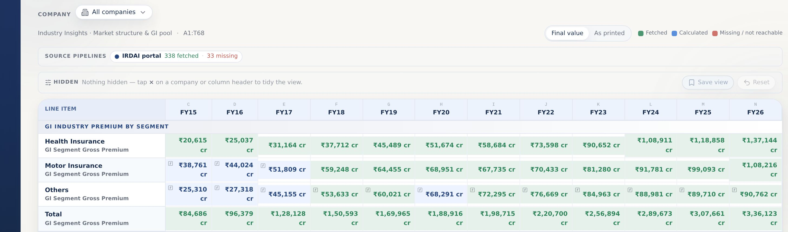

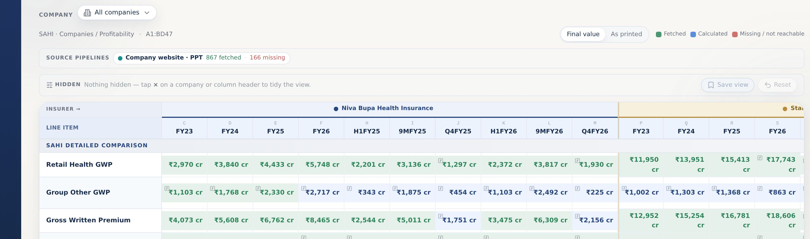

- Every template cell is mirrored and checked against its source — the grid now reads mostly green (fetched & verified), with only a few cells still pending.
- A source-pipeline strip is honest about what is in vs missing (e.g. IRDAI portal — 338 fetched, 33 missing).
- Tap × on any column or company to tidy the view; hidden items sit in a tray and restore in one tap, with Save view / Reset.
- Each company is colour-coded into its own block, and any cell opens its full source on click.

**Note:** Most cells are now fetched & verified (green); the source-pipeline strip stays honest about the few still pending.

---

## 2. Analyst Targets — The average target is finally on the page  
**Status: Implemented**

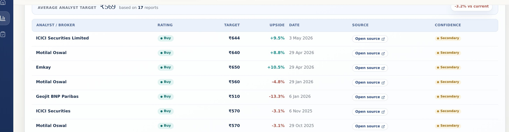

- A single “Average analyst target” reads the mean of every valid broker target — e.g. ₹569 for Star Health.
- It states how many reports it used (“based on 17 reports”) and the move vs the current price.
- Blank, zero and non-numeric targets are dropped before the mean, so one bad row can’t skew it.
- Every broker call sits below with its rating, target, date and a live source — the average recomputes as new coverage lands.

---

## 3. Shareholding Pattern — Ownership movement over time  
**Status: Implemented**

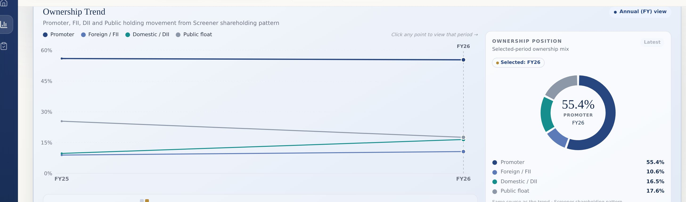

- An Ownership Trend chart tracks Promoter, FII, DII and Public float across years (FY25 → FY26) — click any point to read that period.
- A live donut shows the selected-period mix — Promoter 55.4%, DII 16.5%, Public 17.6%, FII 10.6%.
- Sourced from the exchange shareholding-pattern filing; bulk / block deals are kept separate (they are individual trades, not the quarter-end pattern).
- Movement reads at a glance — promoter steady while public float eases as domestic institutions build.

---

## 4. Valuation — Is the valuation earned?  
**Status: Implemented** · _UPDATED THIS WEEK_

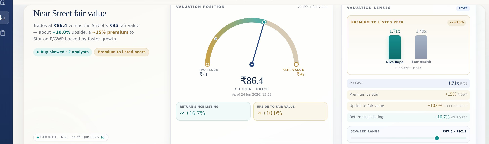

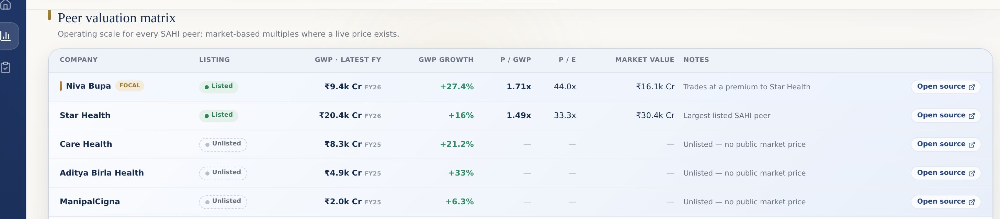

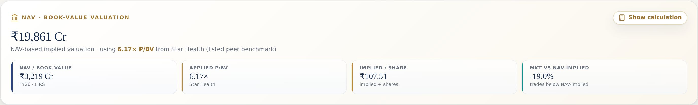

- A redesigned valuation hero: a Street-verdict gauge from the IPO price (₹74) through current (₹86.4) to fair value (₹95) — about +10% upside.
- Valuation lenses show the premium to listed peers (P/GWP 1.71× vs Star 1.49×, ~15% premium) backed by faster growth.
- One clean peer matrix lists every SAHI’s scale and multiples, marking the unlisted ones honestly as “no public market price”.
- A NAV / book-value card adds the asset-based cross-check, with the full workings one click away (“Show calculation”).

**Note:** The valuation page was rebuilt this week — Street-verdict gauge, valuation lenses and one clean peer matrix.

---

## 5. Insights — Source-first audit trail  
**Status: Implemented**

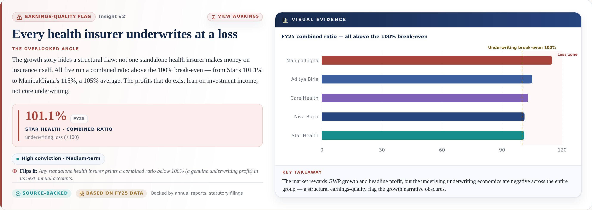

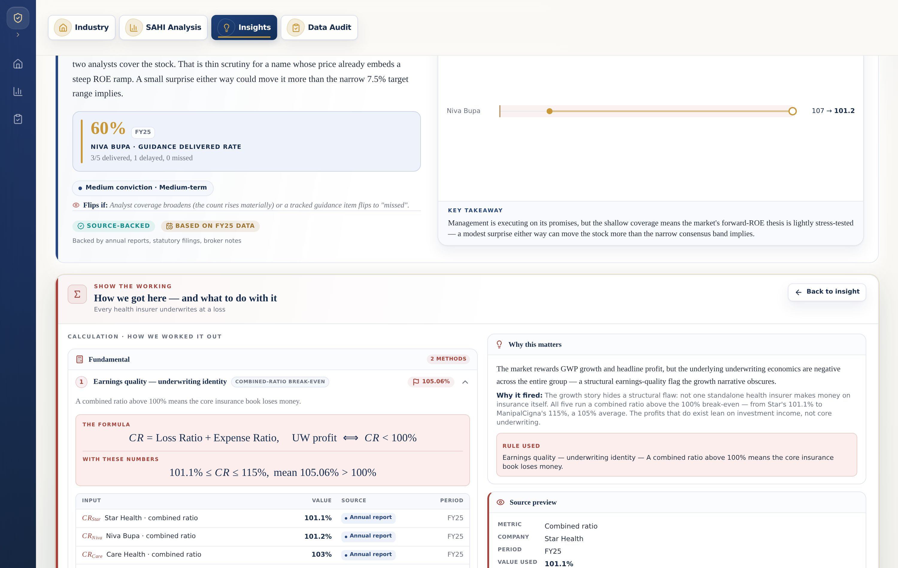

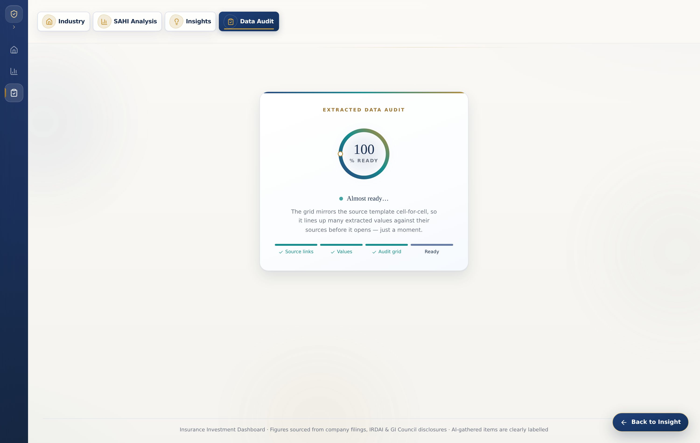

- Insights open Niva-Bupa-first, in plain language, in a compact left-memo / right-chart layout.
- Flip any card to see the workings: the calculation, the data used, and a “Source preview” (metric, company, period, value, confidence).
- The source button goes to the Data Audit cell first — the verification layer — and only falls back to a chart when no audit mapping exists.
- Empty Technical / Macro / Sentiment lenses are dropped, so a card only shows the analysis actually run.
- Period labels are honest (FY25, latest) — they always show the real period.

---

## 6. Insights · Verification loop — Back to the insight after you’ve checked the source  
**Status: Implemented**

- Jumping to a source drops a “Verifying from insight” breadcrumb and pre-selects the right company in the Data Audit grid.
- A floating “Back to Insight” button stays on screen the whole time you’re in the source.
- Clicking it returns you to the exact card you came from — re-flipped to its workings — so you never lose your place.
- This closes the loop: read the insight → verify the number at source → return, in two clicks.

---

## 7. Bulk & Block Deals — Deal records, now with the full picture  
**Status: Implemented** · _UPDATED THIS WEEK_

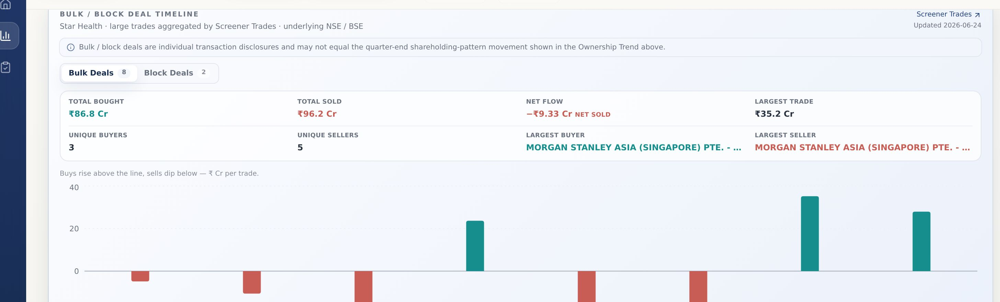

- Bulk and block deals are split into their own tabs (Bulk 8 · Block 2) with a clean buy-above / sell-below timeline.
- A summary reads at a glance — total bought, total sold, net flow (e.g. −₹9.3 Cr net sold) and the largest single trade.
- It also names the unique buyers and sellers and the biggest counterparties (e.g. Morgan Stanley Asia).
- Sourced from NSE / BSE large-trade disclosures, with a note that deals are individual trades, not the quarter-end ownership pattern.

**Note:** Refreshed this week — net flow, largest trade, unique buyers / sellers and named counterparties, dated 2026-06-24.

---

## 8. Sources — Reliable links, and the status is clear  
**Status: Implemented**

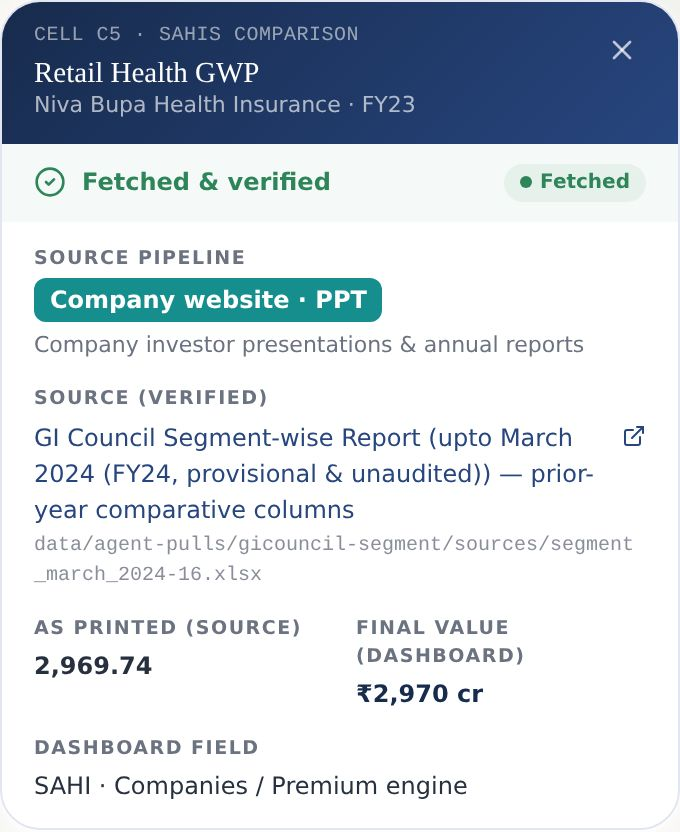

- Each figure shows its source status plainly — click it to see “Fetched & verified”, the source pipeline and a working link.
- Links that tend to break (the exchanges’ session-based pages) are automatically swapped for a stable public page.
- The “as printed” value and the dashboard’s final value sit side by side, with the exact document referenced.
- It’s always clear which numbers are sourced and verified, and which are still pending.

---

## 9. Excel Verifier — Upload a workbook, compare — then jump to any cell  
**Status: Implemented**

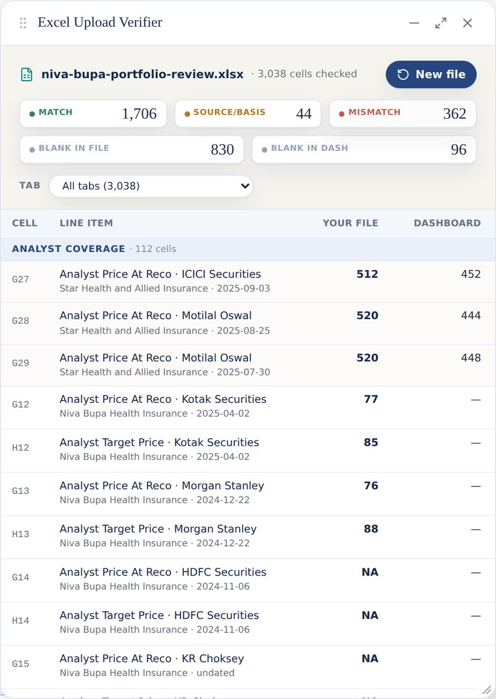

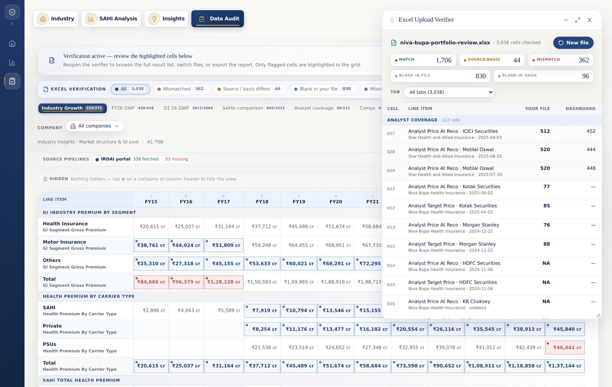

- Drop in your Excel and every cell is checked, line by line, against the dashboard — all in your browser, nothing leaves your computer.
- Five clear outcomes sit on top — Matched, Source / basis differs, Mismatched, Blank in your file, Missing in the dashboard.
- Every result row is clickable — it jumps straight to that exact cell in the Data Audit grid and highlights it, so there’s no manual searching.
- The verifier is a movable, resizable window beside the grid that remembers recent files to re-check in one click. Sample run: 1,706 matched, 44 source / basis, 362 mismatched, 830 blank-in-file, 96 blank-in-dashboard.

---

## 10. Excel Verifier · Data Audit — In the grid, only the problems light up  
**Status: Implemented**

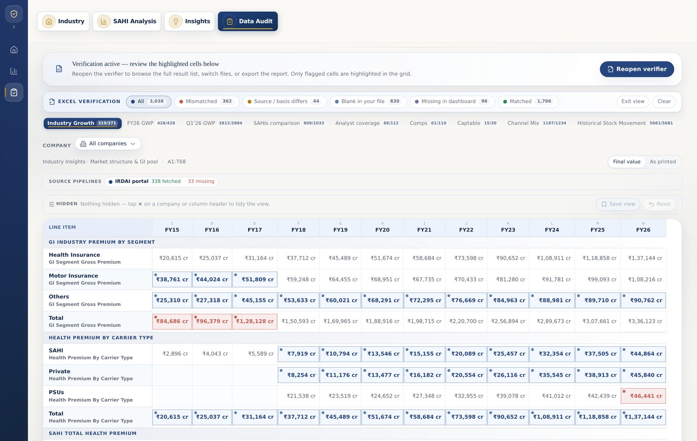

- Once a file is checked, the grid switches to a verification view: matched cells go quiet and neutral, so only the issues draw the eye.
- Soft, premium tints — red for a value mismatch, amber for a source / basis difference, blue for blank-in-your-file, purple for missing-in-dashboard.
- A sticky bar shows the live counts and a one-tap filter that dims everything else, with “Back to Verifier” and “Exit” to restore the normal grid.
- Click any flagged cell for the full story — your value vs the dashboard, the difference, the source, and a “Back to Verifier row” link.

---

## 11. Historical Data — Weekly, monthly, yearly average trends  
**Status: Implemented**

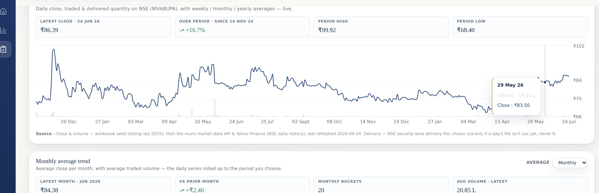

- A live daily close / volume / delivery chart for the stock, with hover read-outs for any day.
- One clean “Average” control rolls it up Weekly, Monthly or Yearly — the chart and the summary update instantly.
- Averages skip days with no trading instead of counting them as zero.
- The roll-up reads at a glance — latest period, change vs prior, and average volume.

---

## Thank you

Prepared for **Paragon Partners (India)**, by **Munshot**.

*2026-06-24 · 56 changes implemented across 9 areas. All screenshots are from the live dashboard.*
